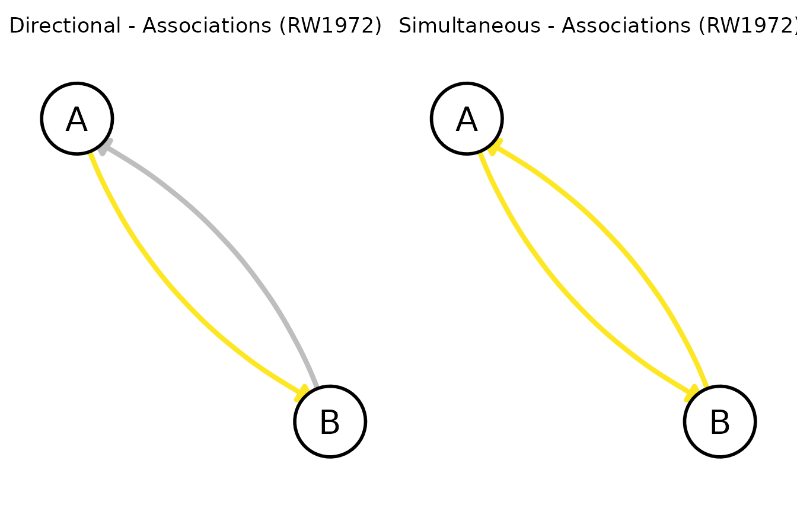
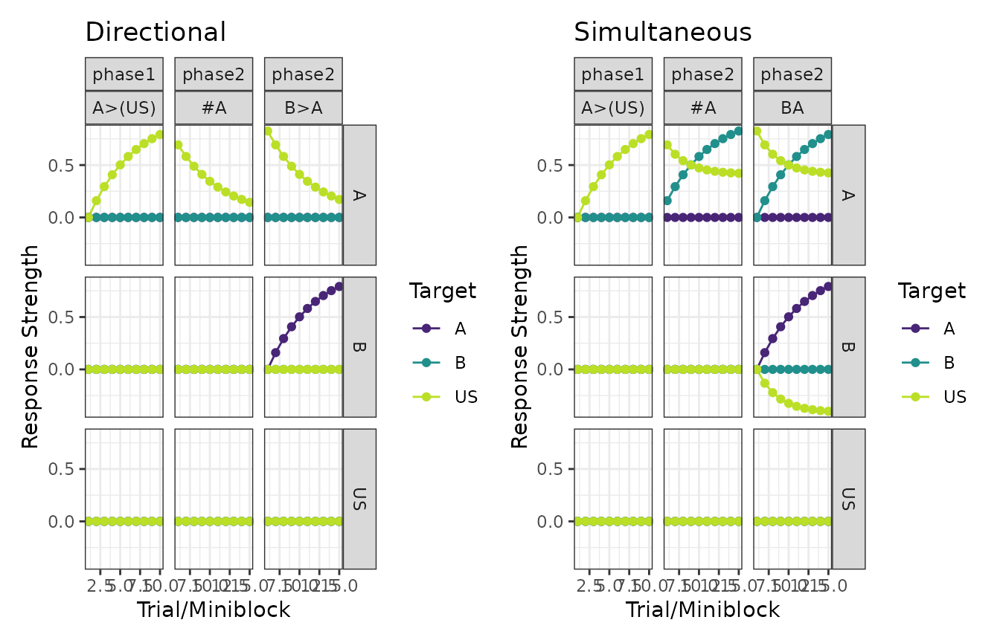

# directional_models

## The behaviour of directional models

Imagine a procedure in which the offset of stimulus A is immediately
followed by the onset of stimulus B. Though it would be reasonable to
assume that the association from A to B might increase, it is not
immediately clear what would happen to the “backward” association (from
B to A).

Though some models propose that in most instances the backward
association will increase (e.g., Honey, Dwyer, and Iliescu 2020), some
models propose that the backward association does not automatically
increase. In `calmr` those models are called “directional models”.
Currently, `calmr` deems the following models as directional:

- [RW1972](https://victornavarro.org/calmr/articles/RW1972.md)
- [MAC1975](https://victornavarro.org/calmr/articles/MAC1975.md)
- [PKH1982](https://victornavarro.org/calmr/articles/PKH1982.md)

## Denoting directional trials

In `calmr`, we denote directional trials by using the `>` symbol between
any two (groups) of stimuli. Doing so tells `calmr` to parse the trial
into trial periods, one followed after the other. As such, specifying a
trial via `1A>B` denotes the delivery of one trial in which stimulus A
appears first, and stimulus B appears second. A few variations on that
theme:

- `1AB` denotes a trial in which A and B are simultaneously presented
  (note there is no `>` symbol).
- `1AB>B` denotes a trial in which A and B are simultaneously presented
  in the first period, but only B remains in the second period.
- `1A>B>A` denotes a trial in which A is presented first, followed by B,
  and then A again.

There is technically no limitation in the number of periods one could
specify, but keep in mind that the number of periods will increase model
runtime.

## The behaviour of directional models

With the generalization of trials into trial periods, `calmr` must
choose how associations should be expressed and learned across periods.

### Expression

For expression, `calmr` assumes that all of the stimuli in the trial
will **simultaneously** contribute to the net responding. Thus, both
stimuli A and B in a `1A>B` trial will contribute to responding, even
though they occur at different times. Similarly, in a `1AB>B` trial,
both A and B will contribute to responding, but B will contribute only
once.

### Learning

For learning, `calmr` takes no shortcuts, updating associations between
**adjacent** periods in the predetermined order these periods appear.
Take for example the `1A>B` trial above. When using the
[RW1972](https://victornavarro.org/calmr/articles/RW1972.md) model
(Rescorla and Wagner 1972), we expect A to associate with B, because A
is followed by B. Mechanistically speaking, the association from A to B
strengthens whenever the presentation of A does not generate a strong
enough expectation of the B that immediately follows it.[¹](#fn1)

It is important to note that the second period of the `A>B` trial also
undergoes updating. As B is presented, it might generate expectations if
it has any associations with other stimuli, but, because B is followed
by nothing, all of those associations will undergo extinction[²](#fn2).

## A simple example

To exemplify all of the above, let’s consider how the RW model behaves
under directional and simultaneous trials. We begin by defining a simple
design:

``` r
library(calmr)
design <- data.frame(
  group = c("Directional", "Simultaneous"),
  phase1 = c("10A>B", "10AB")
)
parsed <- parse_design(design)
print(parsed)
# note: periods are recognized internally; see parsed@mapping
```

Let’s run the model with default parameters and look at the associations
in each group.

``` r
pars <- get_parameters(parsed, model = "RW1972")
exp_res <- run_experiment(design, parameters = pars, model = "RW1972")
patch_graphs(graph(exp_res))
```



As the graphs above show, only the A to B association is positive in the
Directional group, but both the A to B and B to A associations are
positive in the Simultaneous group.

## A more complex example

Let’s now consider a design in which stimulus A is followed by a US in
phase 1, but is itself preceded by stimulus B in phase 2 (with no US). A
second group will have the same treatment in phase 1, but B and A will
be presented simultaneously in phase 2. We will also add probe trials of
A (`#A`) to check how strongly A is associated with the US in both
groups.

``` r
design <- data.frame(
  group = c("Directional", "Simultaneous"),
  phase1 = "10A>(US)",
  phase2 = c("10B>A/10#A", "10BA/10#A")
)
pars <- get_parameters(design, model = "RW1972")
exp_res <- run_experiment(design, parameters = pars, model = "RW1972")
plots <- plot(exp_res, type = "responses")
plots <- lapply(plots, function(x) x + ggplot2::ggtitle(unique(x$data$group)))
patch_plots(plots)
```



To appreciate the key difference between the two groups, focus on the
middle, topmost panel in each group. Those panels show how much
responding A produces on the probe trials (`#A`) during phase 2. Each
line represents a different target stimulus.

When it comes to US-oriented responses, A in the Directional group
undergoes simple extinction. In `B>A` trials, A is not followed by the
US. This is not the case for the Simultaneous group. For that group, the
simultaneous nature of AB trials partially protects the A-US association
from extinguishing, by having B acquire an inhibitory association with
the US (see the center, rightmost panel for the Simultaneous group
above).

## Conclusion

Directional models in `calmr` can have unexpected behaviours, especially
when compared to non-directional models. As such, you must be careful
when specifying the trial periods in your design. Tinkering is your
friend, but if you see any erratic behaviour, please consider dropping
me a line or opening an issue on GitHub.

## References

Honey, Robert C., Dominic M. Dwyer, and Adela F. Iliescu. 2020. “HeiDI:
A Model for Pavlovian Learning and Performance with Reciprocal
Associations.” *Psychological Review* 127 (5): 829–52.
<https://doi.org/10.1037/rev0000196>.

Rescorla, Robert A., and A. R. Wagner. 1972. “A Theory of Pavlovian
Conditioning: Variations in the Effectiveness of Reinforcement and
Nonreinforcement.” In *Classical Conditioning II: Current Research and
Theory.*, edited by A. H. Black and W. F. Prokasy, 64–69. New York:
Appleton-Century-Crofts.

------------------------------------------------------------------------

1.  Internally, we use the stimuli in period p to generate expectations,
    and use the `union` between the stimuli in periods p and p+1 as the
    teaching signal.

2.  Although not covered here, you safely can assume that every
    “learning” step in directional models behaves similarly, regardless
    of whether we update association or other (e.g., attentional)
    weights.
