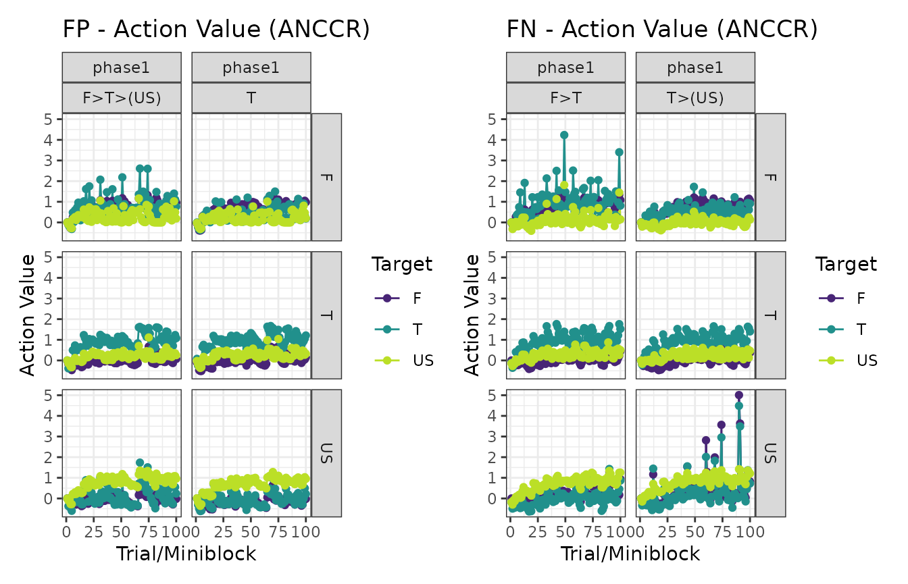
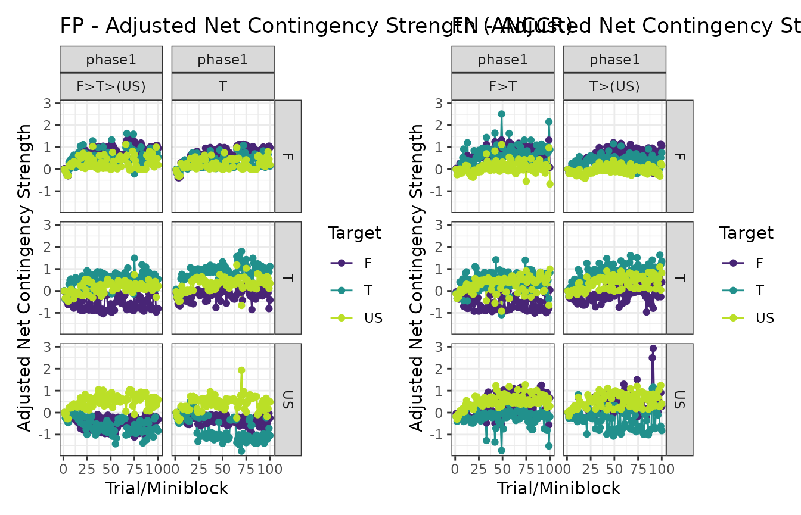
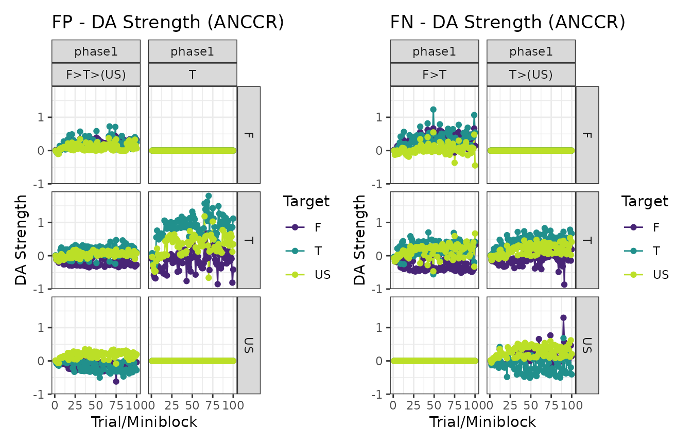

# using_time_models

## Time models in calmr

Version 0.5 of `calmr` introduced its first time-based model, ANCCR
(Jeong et al., 2022), and with it, I wrote several additional tools for
future time-based models.

#### Changes to trial-based models

The biggest change in `calmr` version 0.5 is the use of the “\>”
character and its effect on trial-based models. With the advent of
time-based models, some generalizations had to be made to enable those
models to update across adjacent trial periods. You can learn more about
this in the
[directional_models](https://victornavarro.org/calmr/articles/directional_models.md)
vignette.

#### Specifying a design for time-based models

The designs for time-based models are nearly identical to those for
trial-based models. However, clever use of the “\>” character will
enrich them. Let’s specify a serial feature discrimination experiment:

``` r
library(calmr)
#> 
#> Attaching package: 'calmr'
#> The following object is masked from 'package:stats':
#> 
#>     filter
#> The following object is masked from 'package:base':
#> 
#>     parse
fpfn <- data.frame(
  group = c("FP", "FN"),
  phase1 = c("!100F>T>(US)/100T", "!100F>T/100T>(US)")
)
parse_design(fpfn)
#> CalmrDesign built from data.frame:
#>   group            phase1
#> 1    FP !100F>T>(US)/100T
#> 2    FN !100F>T/100T>(US)
#> ----------------
#> Trials detected:
#>   group  phase trial_names trial_repeats is_test stimuli
#> 1    FP phase1    F>T>(US)           100   FALSE  F;T;US
#> 2    FP phase1           T           100   FALSE       T
#> 3    FN phase1         F>T           100   FALSE     F;T
#> 4    FN phase1      T>(US)           100   FALSE    T;US
```

We can manually specify the timing for the above experiment by calling
the
[`get_timings()`](https://victornavarro.org/calmr/reference/get_timings.md)
function. Manipulating the list returned by that function will result in
a manipulation of the timing between the experimental events.

``` r
ts <- get_timings(fpfn, model = "ANCCR")
ts
#> $use_exponential
#> [1] TRUE
#> 
#> $sample_timings
#> [1] TRUE
#> 
#> $trial_ts
#>      trial post_trial_delay mean_ITI max_ITI
#> 1 F>T>(US)                1       30      90
#> 2        T                1       30      90
#> 3      F>T                1       30      90
#> 4   T>(US)                1       30      90
#> 
#> $transition_ts
#>      trial transition transition_delay
#> 1 F>T>(US)        F>T                1
#> 2 F>T>(US)     T>(US)                1
#> 3      F>T        F>T                1
#> 4   T>(US)     T>(US)                1
```

And now let’s get the parameters for the ANCCR model.

``` r
pars <- get_parameters(fpfn, model = "ANCCR")
# increase learning rates
pars$alpha_reward <- 0.8
pars$alpha <- 0.08
# increase sampling interval to speed up the model
pars$sampling_interval <- 5
pars
#> $reward_magnitude
#>  F  T US 
#>  1  1  1 
#> 
#> $betas
#>  F  T US 
#>  1  1  1 
#> 
#> $cost
#> [1] 0
#> 
#> $temperature
#> [1] 1
#> 
#> $threshold
#> [1] 0.6
#> 
#> $k
#> [1] 1
#> 
#> $w
#> [1] 0.5
#> 
#> $minimum_rate
#> [1] 0.001
#> 
#> $sampling_interval
#> [1] 5
#> 
#> $use_exact_mean
#> [1] 0
#> 
#> $t_ratio
#> [1] 1.2
#> 
#> $t_constant
#> [1] NA
#> 
#> $alpha
#> [1] 0.08
#> 
#> $alpha_reward
#> [1] 0.8
#> 
#> $use_timed_alpha
#> [1] 0
#> 
#> $alpha_exponent
#> [1] 1
#> 
#> $alpha_init
#> [1] 1
#> 
#> $alpha_min
#> [1] 0
#> 
#> $add_beta
#> [1] 0
#> 
#> $jitter
#> [1] 1
```

Let’s make the model’s experience and look at the first 20 entries.

``` r
experiment <- make_experiment(fpfn,
  parameters = pars,
  timings = ts,
  model = "ANCCR"
)
head(experiences(experiment)[[1]], 20)
#>    model group  phase tp       tn is_test block_size trial stimulus      time reward_mag
#> 1  ANCCR    FP phase1  1 F>T>(US)   FALSE          2     1        F  23.38353          1
#> 2  ANCCR    FP phase1  1 F>T>(US)   FALSE          2     1        T  24.38353          1
#> 3  ANCCR    FP phase1  1 F>T>(US)   FALSE          2     1       US  25.38353          1
#> 4  ANCCR    FP phase1  2        T   FALSE          2     2        T  32.49078          1
#> 5  ANCCR    FP phase1  2        T   FALSE          2     3        T  69.82864          1
#> 6  ANCCR    FP phase1  1 F>T>(US)   FALSE          2     4        F 108.73032          1
#> 7  ANCCR    FP phase1  1 F>T>(US)   FALSE          2     4        T 109.73032          1
#> 8  ANCCR    FP phase1  1 F>T>(US)   FALSE          2     4       US 110.73032          1
#> 9  ANCCR    FP phase1  1 F>T>(US)   FALSE          2     5        F 114.16272          1
#> 10 ANCCR    FP phase1  1 F>T>(US)   FALSE          2     5        T 115.16272          1
#> 11 ANCCR    FP phase1  1 F>T>(US)   FALSE          2     5       US 116.16272          1
#> 12 ANCCR    FP phase1  2        T   FALSE          2     6        T 136.08422          1
#> 13 ANCCR    FP phase1  1 F>T>(US)   FALSE          2     7        F 138.40530          1
#> 14 ANCCR    FP phase1  1 F>T>(US)   FALSE          2     7        T 139.40530          1
#> 15 ANCCR    FP phase1  1 F>T>(US)   FALSE          2     7       US 140.40530          1
#> 16 ANCCR    FP phase1  2        T   FALSE          2     8        T 174.19286          1
#> 17 ANCCR    FP phase1  1 F>T>(US)   FALSE          2     9        F 184.77492          1
#> 18 ANCCR    FP phase1  1 F>T>(US)   FALSE          2     9        T 185.77492          1
#> 19 ANCCR    FP phase1  1 F>T>(US)   FALSE          2     9       US 186.77492          1
#> 20 ANCCR    FP phase1  2        T   FALSE          2    10        T 204.17045          1
```

As you can see above, there are several rows per trial, each specifying
a different stimulus. Time-based models like ANCCR run over a time log
because they make ample use of the temporal difference between events.

Let’s run the model and see some plots.

``` r
experiment <- run_experiment(experiment)
```

``` r
# Action values
patch_plots(plot(experiment, type = "action_values"))
```



``` r
# ANCCR
patch_plots(plot(experiment, type = "anccrs"))
```



``` r
# Dopamine transients
patch_plots(plot(experiment, type = "dopamines"))
```



And that’s it! Easy, right?

#### References

Jeong, H., Taylor, A., Floeder, J. R., Lohmann, M., Mihalas, S., Wu, B.,
Zhou, M., Burke, D. A., & Namboodiri, V. M. K. (2022). Mesolimbic
dopamine release conveys causal associations. *Science (New York,
N.Y.)*, *378*, eabq6740. <https://doi.org/10.1126/science.abq6740>
