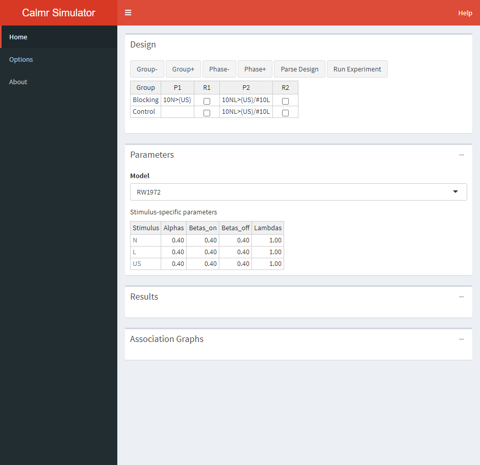

```{r, include = FALSE}
knitr::opts_chunk$set(
  fig.width = 7,
  collapse = TRUE,
  comment = "#>",
  message = FALSE,
  warning = FALSE
)
```

# Using the calm app

If you are a beginner useR or simply want to simulate an experimental design to see what a 
model does, you might be interested in using the calm application.

The calm application offers a GUI that allows you to simulate 
experiments without writing any code. If you want to use the online app, 
you can find it at: [https://victor-navarro.shinyapps.io/calm_app/](https://victor-navarro.shinyapps.io/calm_app/). Alternatively, if you have installed the calm package, you can launch the app via `calm::calm_app()`.
The rest of the tutorial assumes that you have the app open and ready to run. 
Let's break down the GUI.

# The GUI

{width=600px}


## Design Table
The design table is where you specify the experimental design to run. 
Using the Group- and Group+, you can remove or add groups from the design. 
Using the Phase- and Phase+, you can remove or add phases from the design.
The Parse Design button is used to parse the design, 
which is a required step to run the simulation. More on that later.

The P1 and P2 columns above specify the phases in the experiment and are 
simulated from left to right. Each entry in those columns specifies the trials 
given to the corresponding groups (G1 or G2, in this case).
These entries must obey a special syntax (see [calm_basics](calm_basics.html) for additional information).
For now, it will suffice to say that:

* The number of trials is specified via digits to the left of each trial. For example, 10A(US) specifies ten "A(US)" trials.
* Stimuli (or their elements) are specified with letters. For example, 10AB(US) specifies with elements A and B and US.
* Named stimuli are specified within parentheses. For example, (US) implies that there is an element named "US" instead of a compound containing the elements "U" and "S".
* Multiple trials per phase are separated via forward slash (/).

Additionally, one can choose to randomize the trials within each phase by ticking the boxes in the R1 and R2 columns.
It is important to note that whatever the user sets up here will interact with the 
"Create trial blocks" option in the *Options* tab in the sidebar (see ahead). 
Here's the full breakdown of combinations and their behaviour:

* Table checked and preferences checked: Trials will be shuffled within blocks if possible (based on the greater common factor). 
For example, 2A/2B gets shuffled into 2 blocks each containing one A and one B trial, 
but 2A/1B gets shuffled into 1 block containign two A trials and one B trial.
* Table unchecked and preferences checked: Trials will be deterministically intermixed within 
blocks if possible.
For example, 2A/2B gets shuffled into 2 blocks, resulting in the sequence ABAB.
* Table checked and preferences unchecked: Trials will be shuffled completely at random.
* Table unchecked and preferences unchecked: Trials will be given in order of appearance. 
For example, 2A/2B results in the AABB sequence.

Go ahead and parse the design. Some new things will appear on the GUI.

## Parameters

{width=600px}

After parsing a valid design. The user can set up the parameters for the experiment 
(including all stimulus-related and global parameters). 
In this case, the Rescorla-Wagner model has 4 parameters per stimulus.
The default values are fairly sensible, but you can modify each parameter by hand
as you would in your favorite spreadsheet software.

The parametrization of each model in calm can sometimes differ from what appears in the literature.
The following table contains links to the documentation pages for each model.

| Citation                        | Name       | Model page              |
|:-------------------------------:|:----------:|:-----------------------:|
| Rescorla and Wagner (1972)      | RW1972     |[Link](RW1972.html) |
| Mackintosh (1975)               | MAC1975    |[Link](MAC1975.html)|
| Pearce, Kaye, and Hall (1982)   | PKH1982    |[Link](PKH1982.html)|
| Stout and Miller (2007)         | SM2007     |[Link](SM2007.html) |
| Honey, Dwyer and Illiescu (2020)| HDI2020    |[Link](HD2022.html) |
| Honey and Dwyer (2022)          | HD2022     |[Link](HD2022.html) |

## Results

A new button appears after parsing an experiment.
A final click on that button will run the model and populate the
"Results" and "Association Graphs" portions of the app. Go ahead and run the experiment.
After you do, a new button will appear, allowing you to download the results as a spreadsheet.

{width=600px}

In the calm app, the results are shown visually. 
Clicking the bar above the graph 
(the one containing "Blocking - Response Strength ..." above) 
will show you all the plots available. The first portion of each plot's name denotes 
the group's name. In the above, the plot shows the strength of the associations among 
all stimuli in the experiment across trials (or blocks), 
faceted with phases as columns, and origin stimuli as rows. 
For example, the yellow lines above denote the strength that A and B have with the US. 
The top column corresponds to A (look at the label to the right) and the middle column 
corresponds to B.

Go ahead and explore all available plots. These are usually self explanatory, 
but you should consult the documentation of the package in case something is unclear 
(specially when using more obscure models).

## Association Graphs

The bottom portion of the app shows network graphs depicting the 
strength of the associations in the model on a given trial, for all groups. 
Yellow denotes excitatory strength (i.e., positive values), gray denotes neutral strength 
(i.e., values close to zero), and purple (not shown above) shows inhibitory strength 
(i.e., negative values). Move the "Trial" slider to explore how the associations 
in the model change across the experiment.

## Other bits

The sections above implement the bulk of the functionalities in the calm app. 
The following sections describe additional options convenience functions that I found useful.

### Options

Here we set the number of iterations to run the experiment for (important if model behaviour 
is sensitive to trial order effects), and whether we want to create trial blocks. Here we also set 
Here we can choose to plot in a common scale for the y-axis (active by default).

## A final message
Hope you enjoy the app! If you do find any bugs, have comments, 
or would like something implemented, feel free to post a message on 
the package's github repository or drop me a line at navarrov [at] cardiff.ac.uk.


