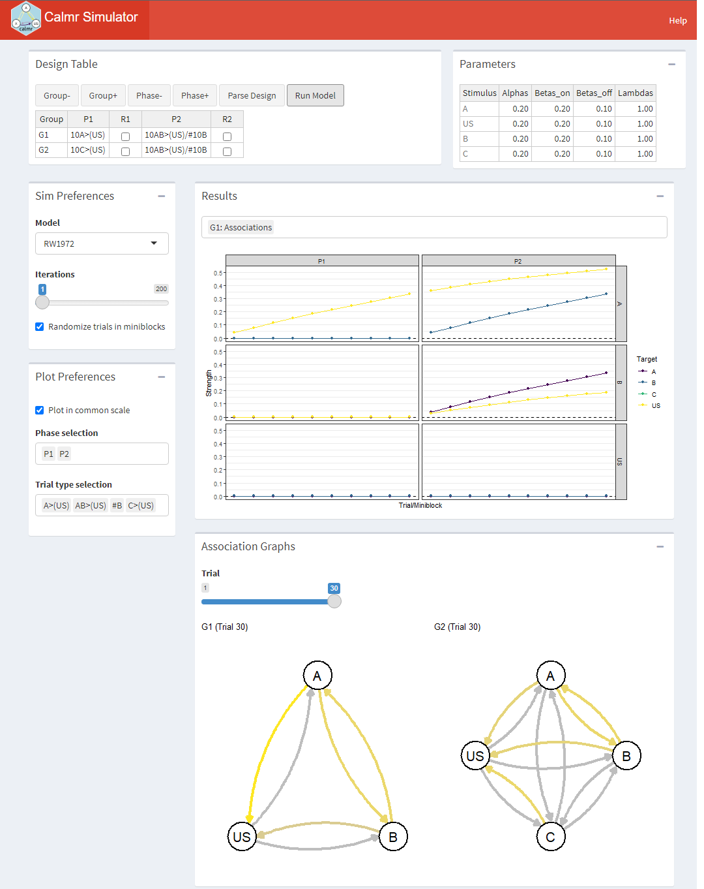

```{r, include = FALSE}
knitr::opts_chunk$set(
  fig.width = 7,
  collapse = TRUE,
  comment = "#>",
  message = F,
  warning = F
)
```

# Using the calmr app

If you are a beginner useR or simply want to simulate an experimental design to see what a model does, you might be interested in using the calmr application.

The calmr application offers a GUI that allows the user to simulate experiments without any code. If you want to use the online app, you can find it at: [https://victor-navarro.shinyapps.io/calmr_app/](https://victor-navarro.shinyapps.io/calmr_app/). Alternatively, if you have installed the calmr package, you can launch the app via `calmr::calmr_app()`. The rest of the tutorial assumes that you have the app open and ready to run. Let's break down the GUI.

# The GUI

{width=600px}


## Design Table
The design table is where the user specifies the experimental design to run. Using the Group- and Group+, we can remove or add groups from the design. Using the Phase- and Phase+, we can remove or add phases from the design. The Parse Design button is used to parse the design, which is a required step to run the simulation. But, let's save that for later.

The P1 and P2 columns above specify the phases in the experiments, they are simulated from left to right. Each row in those columns specifies the trials given to its corresponding group (G1 or G2, in this case). There is a specific syntax to be used here (see [calmr_basics](calmr_basics.html) for additional information), but for now, it will suffice to say that:

* The number of trials is specified via the digits to the left. For example, 10A>(US) specifies ten "A>(US)" trials.
* Stimuli (or their elements) are specified with letters. For example, 10AB>(US) specifies a trial in which elements A and B are followed by element US (see last point).
* Multiple trials per phase are separated via forward slash (/).
* The "delays" between the presentation of the stimuli are specified via the greater-than sign (>). For example, 10A>(US) implies that A is presented, before, but never overlapping with US, and
* Named stimuli are specified within parentheses. For example, (US) implies that there is an element named "US" instead of a compound containing the elements "U" and "S".

Additionally, one can choose to randomize the trials within each phase by ticking the boxes in the R1 and R2 columns. It is important to note that whatever the user sets up here will interact with the "Randomize trials in miniblocks" option in the Sim Preferences portion of the app (see ahead). Here's the full breakdown of the behaviour:

* Table checked and preferences checked: Trials will be shuffled within miniblocks if possible. For example, 2A/2B gets shuffled into 2 blocks each containing one A and one B trial, but 2A/1B gets shuffled into 1 block containign two A trials and one B trial.
* Table unchecked and preferences checked: Trials will be intermixed within miniblocks if possible. For example, 2A/2B gets shuffled into 2 blocks, resulting in the sequence ABAB.
* Table checked and preferences unchecked: Trials will be shuffled completely at random.
* Table unchecked and preferences unchecked: Trials will be given in order of appearance. For example, 2A/2B results in the AABB sequence.

Go ahead and parse the design. Some new things will appear on the GUI.

## Parameters

{width=600px}

After parsing a valid design. The user can set up the parameters for the experiment (including all stimulus-related parameters). In this case, the Rescorla-Wagner model has 4 parameters per stimulus. The default values are fairly sensible, but the user can futher modify the parameters by hand, if desired.

Note that after parsing, a new button, "Run Model" has appeared. A final click on that button will run the model and populate the "Results" and "Association Graphs" portions of the app. Go ahead and run the model.

## Results

{width=600px}

In the calmr app, the results are shown visually. Clicking the bar above the graph (the one containing "G1: Associations" above) will show all the plots available. The first portion of each plot's name denotes the group's name. In this case, the "Associations" plots show the strength of the associations among all stimuli in the experiment across trials (or miniblocks), faceted with phases as columns, and origin stimuli as rows. For example, the yellow lines above denote the strength that A and B have with the US. The top column corresponds to A (look at the label to the right) and the middle column corresponds to B.

Go ahead and explore all available plots. These are usually self explanatory, but you should consult the documentation of the package in case something is unclear (specially when using more obscure models).

## Association Graphs

The bottom portion of the app shows network graphs depicting the strength of the associations in the model on a given trial, for all groups. Yellow denotes excitatory strength (i.e., positive values), gray denotes neutral strength (i.e., values close to zero), and purple (not shown above) shows inhibitory strength (i.e., negative values). Go ahead and move the "Trial" slider to explore how the associations in the model change across the experiment.

## Other bits

The sections above implement the bulk of the functionalities in the calmr app. The following sections describe additional options convenience functions that I found useful.

### Sim Preferences

Here we pick a model (by default, Rescorla & Wagner, 1972), set the number of iterations to run the model for (important if model behaviour is sensitive to trial order effects), and whether we want to create miniblocks.

### Plot Preferences

Here we can choose to plot in a common scale for the y-axis (active by default), or filter out results on the basis of phases or trial types, if we want to.

## A final message
Hope you enjoy the app! If you do find any bugs, have comments, or would like something implemented, feel free to post a message on the package's github repository or drop me a line at navarrov [at] cardiff.ac.uk.


